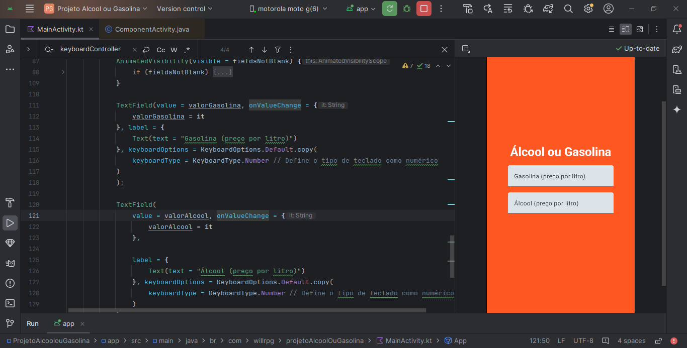
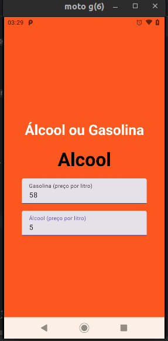
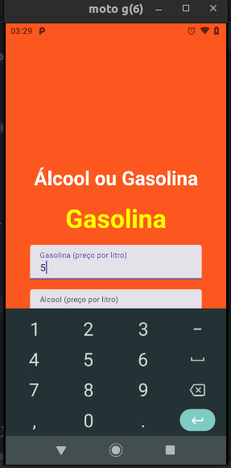

<h1 align="center">Android (Kotlin) - Indicador Alcool ou Gasolina </h1>

  

  

  
  
  
    
   

Este aplicativo tem como a principal funcionalidade retornar se o combustível mais indicado baseado no preço por litro é o álcool ou gasolina.

## 🥶 Sobre o projeto

Desenvolvi esse projeto para reforçar meu conhecimento com android nativo utilizando kotlin.

## Mobile Android Kotlin:

**Aplicativo:** O app deverá receber 2 inputs e somente quando os 2 campos forem preenchidos, exibir em tela se álcool ou gasolina é mais indicado.

## Roadmap

- [x] Iniciar o aplicativo, entrar na tela principal.

- [x] Conseguir adicionar o campo de gasolina e de álcool.

- [x] Conseguir visualizar o resultado dizendo qual o combustível mais indicado.

<!-- --------------------- -->

| Tela Home | Tela Home 2 |
|:-------------------------:|:-------------------------:|
|  |  |

